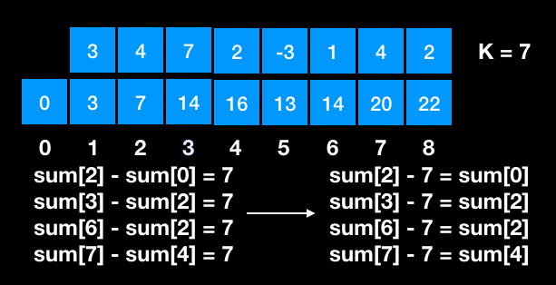

## Description
>Given an array of integers and an integer k, you need to find the total number of continuous subarrays whose sum equals to k.
>
>Example 1:
Input:nums = [1,1,1], k = 2
Output: 2
Note:
The length of the array is in range [1, 20,000].
The range of numbers in the array is [-1000, 1000] and the range of the integer k is [-1e7, 1e7].

## Solution
This question can be solved by using range sum approach. Basically, a sum of a range in a array can be calculated as below:  

So, for this question, we can keep records of sum along with the array iteration, then check if there is an element in the past that helps build a range sum equals to target K.  



## Code
``` cpp
class Solution {
public:
    int subarraySum(vector<int>& nums, int k) {
        int sum = 0, res = 0;
        unordered_map<int, int> preSumCount;
        preSumCount[0] = 1;                     /*❶*/
        for(int i = 0; i < nums.size(); ++i) {
            sum += nums[i];
            if(preSumCount.count(sum - k)){     /*❷*/
                res += preSumCount[sum - k];
            }
            preSumCount[sum]++;                 /*❸*/
        }
        return res;
    }
};
```
❶ key is the sum value at current index, value is the number of current sum value.  
❷ check if we have a right value, conforms sum(current) - sum(aValue) = K.  
❸ update the map states.  
