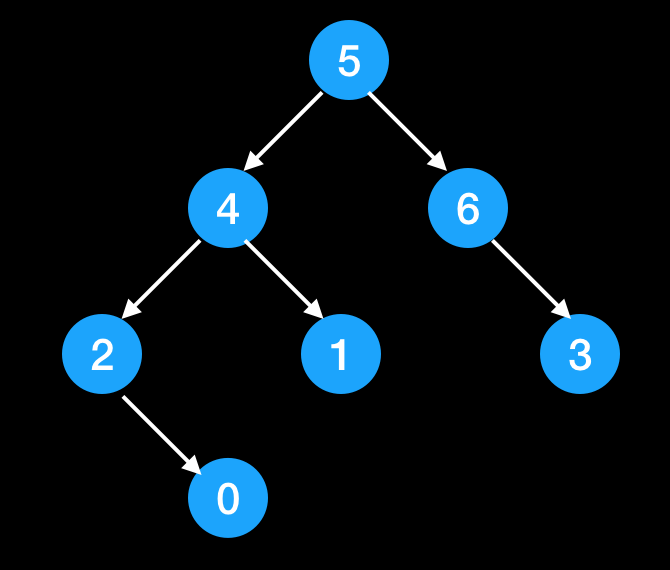

## Traverse of the binary tree
In general, there are fours ways to traverse a tree, they are pre-order, in-order, post-order, and level-order. For the first three ways, we can do it clearly by using recursive as below.
```cpp
void traverseTree(TreeNode* root) {
	// base case of recursive
	cout << root->value;      /*❶*/
	traverseTree(root->left);
	cout << root->value;      /*❷*/
	traverseTree(root->right);
	cout << root->value;      /*❸*/
}
```
❶ visit root value here is pre-order  
❷ visit root value here is in-order  
❸ visit root value here is post-order  
  
So for a tree as below, we can have three traverse result:  
pre-order: [5, 4, 2, 0, 1, 6, 3]  
in-order: [2, 0, 4, 1, 5, 6, 3]  
post-order: [0, 2, 1, 4, 3, 6, 5]  
And level order traverse is simple: [3, 4, 6, 2, 1, 3, 0]  

## Categories of binary tree question
- General binary tree/binary search tree recursive question.
Almost 99% of the binary tree question can be solved in recursive way. And there are three kind of question in general.     
	- pass the result value from top down to bottom.  
Eg. Check valid BST( leetcode 98)  
	- pass the result value from bottom to top.  
Eg. Get Height of the tree. Check tree is balanced (leetcode 110). Check tree is symmetric (leetcode 101). Assign the value of each node to be the total number of nodes that belong to its left substree.  
	- Pass the help value from bottom to top, and meanwhile update the result according to the help value. Most hard problem can be done by this approach. and there are many questions in leetcode you can practice.  
- Rebuild tree  
Use two kinds of traverse result to rebuild the tree.
- Serialize the tree structure.  
- Binary search tree  
To use BST properties to solve the problem.  
- Level order traverse question  

## Key points
1. Have to decide **which kind of traverse** we gonna use.
Eg. if it is BST and we want to leverage the ordered property of the BST. In-order traverse is nice to use. if we want the value from left subtree and right subtree, post order is good to use.
2. Decide **what operations** we need to do for current node.
Eg. What values we need to return? how we update the result value? What relationship among root and its left subtree, right subtree.

## Question List
We are keep tracking the binary search tree question, I will try to categorize each question. Another thing good to mention is many question can be solve in different way, but they all fits in categories we talked above.

| ID |Question | Type |
| ----------- | ----------- | ----------- |
|94|    Binary Tree Inorder Traversal| XXX|
|95|    Unique Binary Search Trees II|XXX|	
|96|    Unique Binary Search Trees|XXX|	
|98|    Validate Binary Search Tree|XXX|
|99|    Recover Binary Search Tree|XXX|	
|100|   Same Tree|XXX|	
|101|   Symmetric Tree|XXX|	
|102|   Binary Tree Level Order Traversal|XXX|	
|103|   Binary Tree Zigzag Level Order Traversal|XXX|	
|104|	Maximum Depth of Binary Tree|后序，从下往上返回值|	
|105|	Construct Binary Tree from Preorder and Inorder Traversal|XXX|	
|106|	Construct Binary Tree from Inorder and Postorder Traversal|XXX|
|107|	Binary Tree Level Order Traversal II|XXX|	
|108|	Convert Sorted Array to Binary Search Tree|XXX|	
|110|	Balanced Binary Tree|XXX|
|111|	Minimum Depth of Binary Tree|XXX|
|112|	Path Sum|XXX|	
|113|	Path Sum II|XXX|
|114|	Flatten Binary Tree to Linked List|XXX|
|116|	Populating Next Right Pointers in Each Node|XXX|
|117|	Populating Next Right Pointers in Each Node|XXX|
|124|	Binary Tree Maximum Path Sum|后序，从下往上返回值，并更新结果|	
|129|	Sum Root to Leaf Numbers|XXX|
|144|	Binary Tree Preorder Traversal|XXX|
|145|	Binary Tree Postorder Traversal|XXX|
|156|	Binary Tree Upside Down|XXX|
|173|	Binary Search Tree Iterator|XXX|
|199|	Binary Tree Right Side View|XXX|
|222|	Count Complete Tree Nodes|XXX|	
|226|	Invert Binary Tree|XXX|
|230|	Kth Smallest Element in a BST|XXX|	
|235|	Lowest Common Ancestor of a Binary Search Tree|XXX|	
|236|	Lowest Common Ancestor of a Binary Tree|XXX|
|250|	Count Univalue Subtrees|XXX|	
|255|	Verify Preorder Sequence in Binary Search Tree|XXX|	
|257|	Binary Tree Paths|XXX|	
|270|	Closest Binary Search Tree Value|XXX|	
|272|	Closest Binary Search Tree Value II|XXX|	
|285|	Inorder Successor in BST|XXX|
|297|	Serialize and Deserialize Binary Tree|XXX|	
|298|	Binary Tree Longest Consecutive Sequence|XXX|	
|333|	Largest BST Subtree|XXX|
|337|	House Robber III|XXX|	
|366|	Find Leaves of Binary Tree|XXX|
|404|	Sum of Left Leaves|XXX|	
|426|	Convert Binary Search Tree to Sorted Doubly Linked List|XXX|
|428|	Serialize and Deserialize N-ary Tree|XXX|	
|429|	N-ary Tree Level Order Traversal|XXX|	
|431|	Encode N-ary Tree to Binary Tree|XXX|	
|437|	Path Sum III|XXX|	
|449|	Serialize and Deserialize BST|XXX|
|450|	Delete Node in a BST|XXX|
|501|	Find Mode in Binary Search Tree|XXX|
|508|	Most Frequent Subtree Sum|XXX|
|510|	Inorder Successor in BST II|XXX|
|513|	Find Bottom Left Tree Value	|XXX|
|515|	Find Largest Value in Each Tree Row|XXX|
|536|	Construct Binary Tree from String|XXX|
|538|	Convert BST to Greater Tree|XXX|
|543|	Diameter of Binary Tree|XXX|	
|545|	Boundary of Binary Tree|XXX|
|549|	Binary Tree Longest Consecutive Sequence II|XXX|
|559|	Maximum Depth of N-ary Tree|XXX|	
|563|	Binary Tree Tilt|XXX|
|572|	Subtree of Another Tree|XXX|	
|582|	Kill Process|XXX|
|589|	N-ary Tree Preorder Traversal|XXX|	
|590|	N-ary Tree Postorder Traversal|XXX|
|606|	Construct String from Binary Tree|XXX|	
|617|	Merge Two Binary Trees|XXX|
|623|	Add One Row to Tree|XXX|
|637|	Average of Levels in Binary Tree|XXX|	
|652|	Find Duplicate Subtrees|XXX|	
|653|    Two Sum IV - Input is a BST|XXX|
|654|	Maximum Binary Tree|XXX|
|655|	Print Binary Tree|XXX|
|662|	Maximum Width of Binary Tree|XXX|	
|663|	Equal Tree Partition|XXX|
|666|	Path Sum IV|XXX|
|669|	Trim a Binary Search Tree|XXX|	
|671|	Second Minimum Node In a Binary Tree|XXX|	
|684|	Redundant Connection|XXX|
|685|	Redundant Connection II|XXX|	
|687|	Longest Univalue Path|XXX|	
|700|	Search in a Binary Search Tree|XXX|	
|701|	Insert into a Binary Search Tree|XXX|	
|742|	Closest Leaf in a Binary Tree|XXX|
|814|	Binary Tree Pruning|XXX|
|834|	Sum of Distances in Tree|XXX|	
|863|	All Nodes Distance K in Binary Tree|XXX|
|865|	Smallest Subtree with all the Deepest Nodes|XXX|
|872|	Leaf-Similar Trees|XXX|
|889|	Construct Binary Tree from Preorder and Postorder Traversal|XXX|
|894|	All Possible Full Binary Trees|XXX|
|897|	Increasing Order Search Tree|XXX|	
|919|	Complete Binary Tree Inserter|XXX|
|951|	Flip Equivalent Binary Trees|XXX|
|958|	Check Completeness of a Binary Tree|XXX|
|965|	Univalued Binary Tree|XXX|	
|968|	Binary Tree Cameras|XXX|	
|971|	Flip Binary Tree To Match Preorder Traversal|XXX|
|979|	Distribute Coins in Binary Tree|XXX|
|987|	Vertical Order Traversal of a Binary Tree|XXX|
|988|	Smallest String Starting From Leaf|XXX|
|993|	Cousins in Binary Tree|XXX|	
|998|	Maximum Binary Tree II|XXX|
