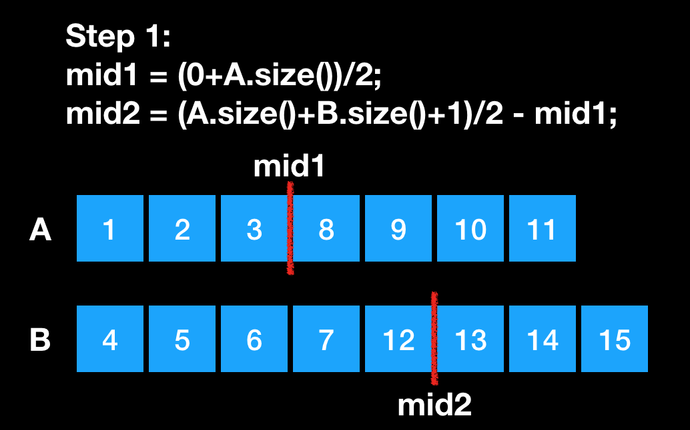
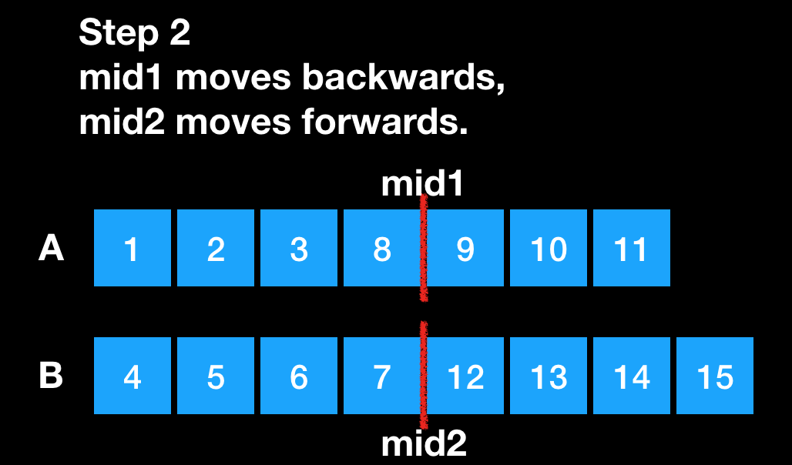

## Description
>There are two sorted arrays nums1 and nums2 of size m and n respectively.
>Find the median of the two sorted arrays. The overall run time complexity should be O(log (m+n)).
>You may assume nums1 and nums2 cannot be both empty.
>
>Example 1:
nums1 = [1, 3]
nums2 = [2]
The median is 2.0
>
>Example 2:
nums1 = [1, 2]
nums2 = [3, 4]
>
>The median is (2 + 3)/2 = 2.5

## Solution
This question can be solved in two ways. one is using find kth number in two sorted array. another is binary search. Let us talk about the binary search approach.
First, we should know what's the meaning of the median. Here is the quote from wiki:
> The median is the value separating the higher half from the lower half of a data sample.
So for the odd number of data element, the median will be the mid element. For the even number of data element, the median will be the average of mid two elements. Lets take the example from wiki:

  

After we know the definition of median, lets think about how can we find the median in two sort arrays. If it is one sorted array, we just need find one separating position in that array which is the mid position. So in two sorted array, what we need to do is find two separating positions in two arrays, which we can get two merged parts from two array with same size. Then we can simply calculate the median by the mid elements.  

lets say we find two separating positions which help us get two merged array with same size,  but we still have to make sure the first merged half are not larger than the second merged half. At this point, we are safe to use the elements at separating position.  

For example:
We have two sorted arrays as below, calculate the two separating positions, mid1 and mid2. we will make first half has one more element when element number id odd.  
   

Then we check if all the elements in first  merged half not larger than the elements in second merged half. In this case, 12 is larger than 8. so we move mid1 backwards, and mid2 forwards to make sure the same size. And then we check again. This time works. and the median is max(8, 7).  
  


## Code
```cpp
lass Solution {
public:
    double findMedianSortedArrays(vector<int>& nums1, vector<int>& nums2) {
        int N1 = nums1.size();
        int N2 = nums2.size();
        if (N1 > N2) return findMedianSortedArrays(nums2, nums1);	
        int lo = 0, hi = N1;
        while (lo <= hi) {
            int mid1 = (lo + hi) / 2;       /*❶*/
            int mid2 = (N1+N2+1)/2 - mid1;  /*❷*/
            
            double L1 = (mid1 == 0) ? INT_MIN : nums1[mid1-1];	/*❸*/ 
            double R1 = (mid1 == N1) ? INT_MAX : nums1[mid1];
            double L2 = (mid2 == 0) ? INT_MIN : nums2[mid2-1];
            double R2 = (mid2 == N2) ? INT_MAX : nums2[mid2];
            
            if (L1 > R2) hi = mid1 - 1;		    /*❹*/ 
            else if (L2 > R1) lo = mid1 + 1;	/*❺*/
            else {                              /*❻*/
                if((N1+N2)%2 == 0){
                    return (max(L1,L2) + min(R1, R2)) / 2;
                } else {
                    return max(L1, L2);
                }
            }
        }
        return -1;
};
```  

❶ Make sure num1 is the shorter one, we will do binary search on the shore one, why?.  
❷ Find separating position mid2 in short array num2.  
❸ Base on same size, calculate separating position in long array num2.  
❹ Get L1, R1, L2, R2 respectively at separating position.  
❺ The num1's lower half is too big, need to move mid1 to left.  
❻ The num2's lower half is too big,  need to move mid1 to right.  
❼ L1 <= R2 && L2 <= R1, and we have two partitions with same number of elements.  
