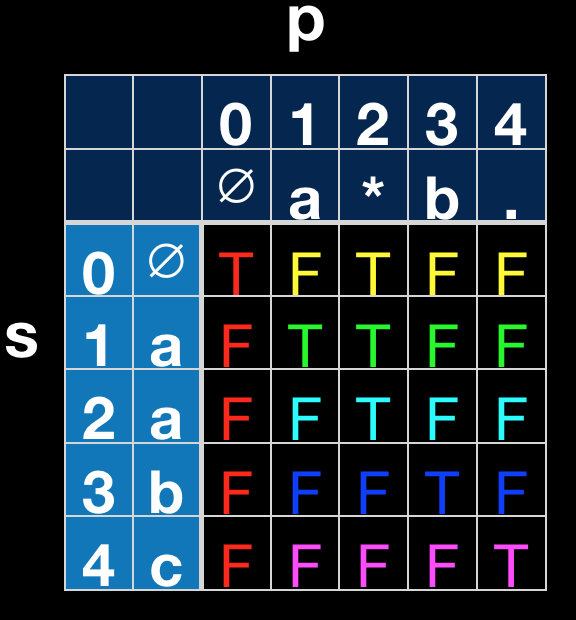

## Description
>Given an input string (s) and a pattern (p), implement regular expression matching with support for '.' and '*'.
>
> '.' Matches any single character.  
'*' Matches zero or more of the preceding element.  
The matching should cover the entire input string (not partial).
>
>Note:
s could be empty and contains only lowercase letters a-z.
p could be empty and contains only lowercase letters a-z, and characters like . or *.
>
>Example 1:
>Input:
s = "aa"
p = "a"
Output: false  
Explanation: "a" does not match the entire string "aa".
>
>Example 2:
Input:
s = "aa"
p = "a*"
Output: true  
Explanation: '*' means zero or more of the precedeng element, 'a'. Therefore, by repeating 'a' once, it becomes "aa".
>
>Example 3:
Input:
s = "ab"
p = ".*"
Output: true  
Explanation: ".*" means "zero or more (*) of any character (.)".
>
>Example 4:
Input:
s = "aab"
p = "c*a*b"
Output: true  
Explanation: c can be repeated 0 times, a can be repeated 1 time. Therefore it matches "aab".
>
>Example 5:
Input:
s = "mississippi"
p = "mis*is*p*."
Output: false

## Solution

Use dynamic programming. dp[i][j] means if s[0...i-1] matches p[0...j-1].  
$$dp[i][j] = \begin{cases}
dp[i-1][j-1] \wedge (p[j-1] =s[i-1] \vee p[j-1]= '.') &  \text{ if } p[i-1]!= '*' \\ 
 dp[i][j-2] \vee (dp[i-1][j] \wedge (p[j-2] = s[i-1] \vee p[j-2]='.'))& \text{ if } p[i-1]='*';
\end{cases}$$  

The first case is easy to understand. Let check the second case, if p[j-1] = '*' and we use * to match zero time, dp[i][j] = dp[i][j-2], it is because we want to match zero time, which (x*) is not useful and can be discarded. eg. aa* matches a. if we want to match more then zero times, which (x*) can be use multiple times. So if dp[i][j] = dp[i-1][j] &s[i-1] = p[j-2]. eg, aa* matches aaa, aa* doesn't match abaa. 

Also for all the dot, we can think of it equals to any character. please go through the example below to fully understand it.


## Code
```cpp
class Solution {
public:
    bool isMatch(string s, string p) {
        int m = s.size();
        int n = p.size();
        vector<vector<bool>> res(m + 1, vector<bool>(n + 1, false));
        res[0][0] = true; //s[0..i-1] p[0..j-1]
        for(int i = 2; i <= n; ++i){
            if('*' == p[i-1] && res[0][i-2]) {
                res[0][i] = true;
            }
        }
        for(int i = 1; i <= m; ++i) {
            for(int j = 1; j <= n; ++j) {
                if(p[j-1] != '*') {
                    res[i][j] = res[i-1][j-1] && (s[i-1] == p[j-1] || '.' == p[j-1]);
                } else {
                    res[i][j] = res[i][j-2] /*match zero */|| (res[i-1][j] && (s[i-1] == p[j-2] || '.' == p[j-2])/*math more than zero times*/);
                }
            }
        }

        return res[m][n];
    }
};
```
